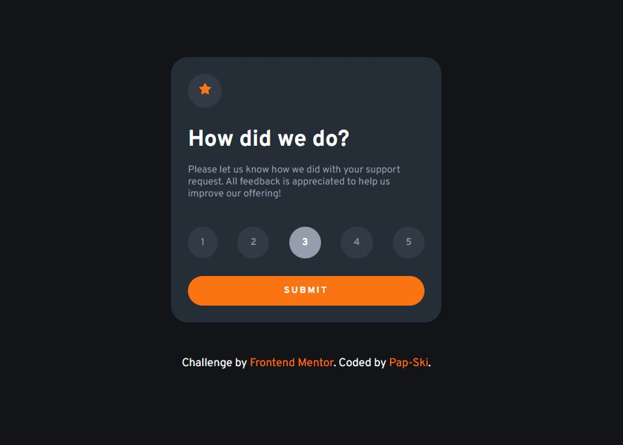

# Frontend Mentor - Interactive rating component solution

This is a solution to the [Interactive rating component challenge on Frontend Mentor](https://www.frontendmentor.io/challenges/interactive-rating-component-koxpeBUmI). Frontend Mentor challenges help you improve your coding skills by building realistic projects.

## Table of contents

- [Frontend Mentor - Interactive rating component solution](#frontend-mentor---interactive-rating-component-solution)
  - [Table of contents](#table-of-contents)
  - [Overview](#overview)
    - [The challenge](#the-challenge)
    - [Screenshots](#screenshots)
    - [Links](#links)
  - [My process](#my-process)
    - [Built with](#built-with)
    - [What I learned](#what-i-learned)
  - [Author](#author)

## Overview

### The challenge

Users should be able to:

- View the optimal layout for the app depending on their device's screen size
- See hover states for all interactive elements on the page
- Select and submit a number rating
- See the "Thank you" card state after submitting a rating

### Screenshots




### Links

- Live Site URL: [(https://fem-interactive-rating-component-rho.vercel.app/)](https://fem-interactive-rating-component-rho.vercel.app/)
- Solution URL: [(https://www.frontendmentor.io/solutions/interactive-rating-component-with-html-css-and-javascript-sub2-92UkaYbD2l)](https://www.frontendmentor.io/solutions/interactive-rating-component-with-html-css-and-javascript-sub2-92UkaYbD2l)

## My process

### Built with

- Semantic HTML5 markup
- CSS custom properties
- Flexbox
- Mobile-first workflow

### What I learned

I learnt how to use `data-attribute` in HTML to manipulate how the cards in Javascript

```html
<div class="wrapper rate-remark align-center" data-hidden="true"></div>
```

```js
submitBtn.addEventListener("click", () => {
  rateSelectionContainer.setAttribute("data-hidden", true);
  rateRemarkContainer.setAttribute("data-hidden", false);
};
```

## Author

- Frontend Mentor - [Pap-Ski](https://www.frontendmentor.io/profile/Pap-Ski)
- LinkedIn - [Nii Laryea Quartey-Papafio](https://www.linkedin.com/in/nii-laryea-quartey-papafio-229440176/)
